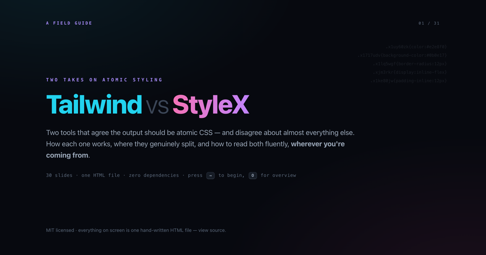

# Tailwind CSS vs StyleX — a field guide

A **standalone slide deck** comparing two takes on atomic styling: **Tailwind CSS** (a dictionary of
utility classes, compiled by scanning your source) and **StyleX** (typed style objects, compiled by
a Babel plugin).

Not a migration pitch in either direction — a symmetric comparison. Every split shows what each
side buys you *and* what it costs.

**One hand-written HTML file. No build step. No dependencies. No network requests.**

## ▶ View it live

**https://dima-gusyatiner.github.io/tailwind-vs-stylex/**

Every slide is deep-linkable — jump straight to
[the cheat sheet](https://dima-gusyatiner.github.io/tailwind-vs-stylex/#30),
[the interactive merge playground](https://dima-gusyatiner.github.io/tailwind-vs-stylex/#10), or
[the verdict](https://dima-gusyatiner.github.io/tailwind-vs-stylex/#29).

## What's inside (31 slides)

| Chapter | Covers |
| --- | --- |
| 0 · The course | Same jobs / two owners, and the six splits in one screen |
| 1 · Meet Tailwind | Tailwind in the wild (the shadcn stack), and what Tailwind *actually* is: a compiler that emits atomic CSS |
| 2 · Meet StyleX | The compiler, the atomic-CSS math both tools share, and a **live merge-model playground** |
| 3 · The six splits | strings ↔ typed data · stylesheet ↔ call site · naming ↔ imports · open ↔ negotiated · portability ↔ depth · vocabulary ↔ CSS |
| 4 · Side by side | Layout, states, responsive, dark mode, variants, composition, animation & runtime values — the same thing written both ways |
| 5 · Toolchain & ecosystem | Pairing with a behavior layer, adoption & pedigree, wiring and day-to-day DX |
| 6 · Verdicts | Tradeoffs both directions, day-one gotchas both directions, **choose-X-when**, and the cheat sheet |

## Controls

| Key | Action |
| --- | --- |
| `→` / `space` / `←` | navigate |
| `O` | overview grid (click a slide to jump) |
| `?` | help |
| `Home` / `End` | first / last slide |
| URL hash | deep-links every slide (`#12`) |

Code blocks have a `copy` button. The syntax highlighter, slide engine, and the slide-10 merge
simulator are all in the one file — view source.

## More in this series

- **[Radix vs React Aria](https://github.com/dima-gusyatiner/radix-vs-react-aria)** — the behavior
  half of the same component. Same deck engine, same format.

## Accuracy

Written **August 2026**, against **Tailwind v4.3** and **StyleX v0.19**.

Comparisons rot. If something here is out of date or unfair to either tool, please
[open an issue](https://github.com/dima-gusyatiner/tailwind-vs-stylex/issues) or send a PR —
corrections are the most useful contribution to a deck like this.

## Run it locally

- Open `index.html` in a browser. That's it.
- Or serve it: `npx serve .`

## License

MIT — fork it, present it, reskin it.
